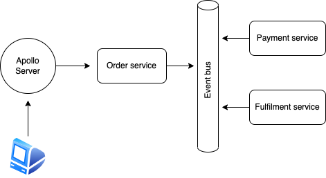

# event-driven-coffee

Full stack coffee ordering app with Svelte for frontend and event driven architecture for backend using AWS services. This is just a demo app to showcase the event driven integration pattern.

## Architecture



### Components

- **Frontend**: Svelte
- **Backend**:
  - GraphQL API (GraphQL Yoga Server + Prisma on ECS)
  - SNS - SQS Fanout Architecture to handle asynchronous events
  - Event Bus (AWS EventBridge)
  - Order management microservice (AWS Lambda)
  - Payment microservice (AWS Lambda)
  - Fulfilment microservice (AWS Lambda)

## Deployment

For serverless deployment, serverless framework is used. I am using my custom AWS profile for deployment. You can change it in `serverless.yml` file.

```yml
provider:
  name: aws
  runtime: nodejs16.x
  stage: dev
  region: ap-southeast-2
  profile: dina # replace dina with your profile name or delete this if default profile is used
```
